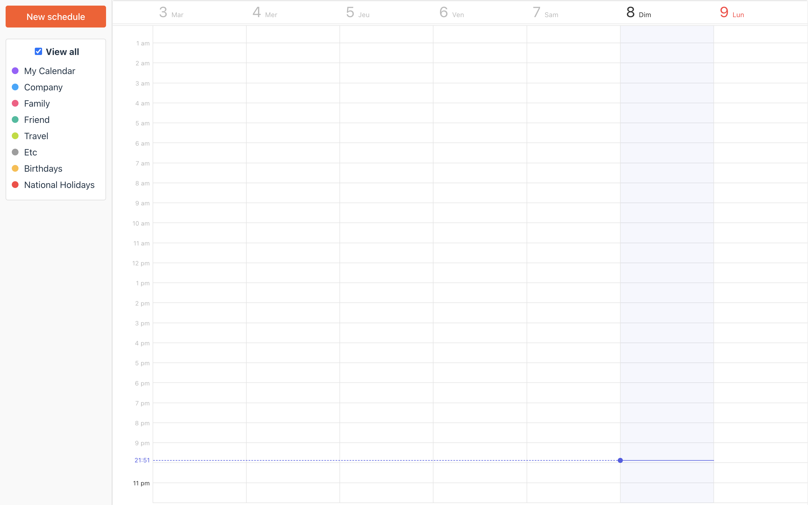

<div align="center"> 

# LightAgenda - Projet E5 BTS

LightAgenda est une application de gestion d'agenda simplifiée, développée avec **ElectronJS** et **VueJS**

</div>



## À propos

Ce projet utilise [ViteJS](https://vitejs.dev) pour la construction et le service du front-end (alimenté par Vue). ViteJS offre un rechargement à chaud (HMR) pour faciliter et accélérer le développement ⚡

## Fonctionnalités

LightAgenda permet à l'utilisateur de visualiser un calendrier. En cliquant sur une date, l'utilisateur peut ajouter un événement à cette date. L'interface utilisateur est conçue avec PrimeVue pour offrir une expérience utilisateur moderne et réactive.

## Prérequis

Avant de commencer, assurez-vous d'avoir installé les logiciels suivants sur votre machine :

- [Node.js](https://nodejs.org/) (version 14 ou supérieure)
- [Git](https://git-scm.com/)

## Installation

### Cloner le dépôt

SSH:
`git clone git@github.com:latomate07/lightagenda.git`

HTTPS:
`git clone https://github.com/latomate07/lightagenda.git`

### Installer les dépendances ⏬

```bash
npm install
```

### Lancer la version locale (sans fichier exécutable) ⚒️

```bash
npm run dev
```

### Générer les fichiers exécutables (macOS, Linux, Windows)

```bash
npm run build # construit l'application, les fichiers distribuables se trouvent dans le dossier "dist"

# OU

npm run build:win # utilise Windows comme cible de construction
npm run build:mac # utilise macOS comme cible de construction
npm run build:linux # utilise Linux comme cible de construction
```

## Structure du projet

```bash
- scripts/ # tous les scripts utilisés pour construire ou servir votre application
- src/
  - main/ # Fil principal (source de l'application Electron)
  - renderer/ # Fil de rendu (source de l'application VueJS)
```